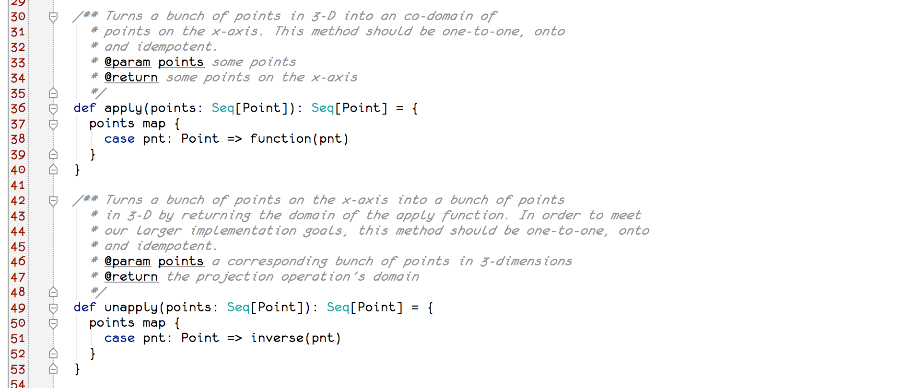
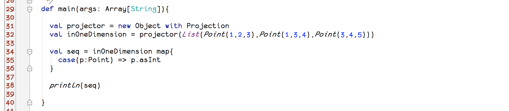
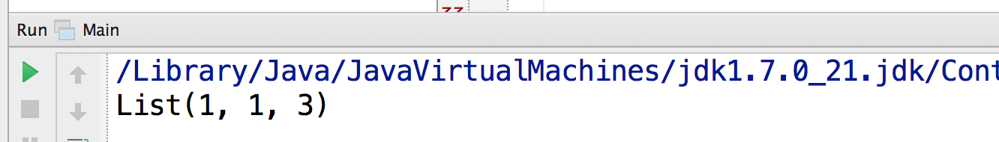
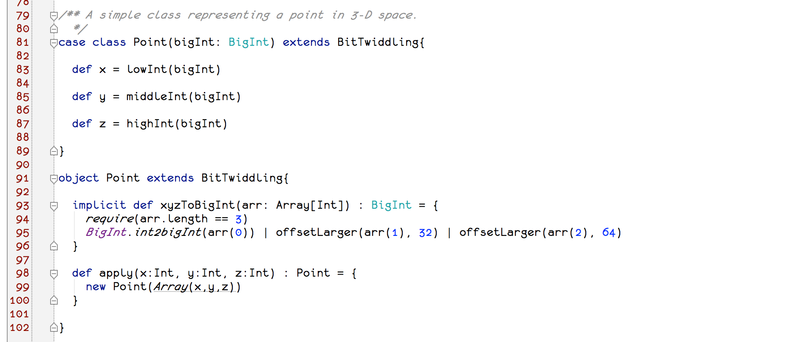
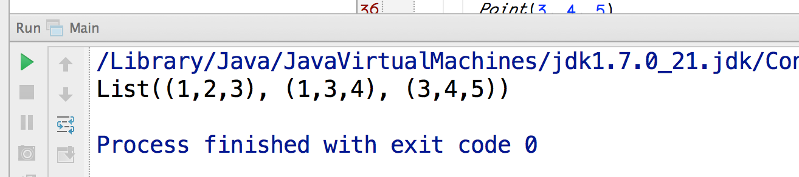
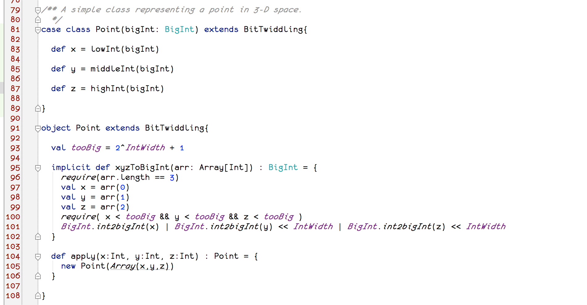

<link rel='stylesheet' href='../css/markdown7.css'/>
## Overview

There is a large category of computational problems that can be solved by storing a map of truth values.
Since a given value can be stored in a single bit, it is relatively cost-effective to pre-calculate values for large
combinations of [first-order logical](http://en.wikipedia.org/wiki/First-order_logic) constructs. Even problems
that do not appear to be formally logical in nature can be solved by trading precision in continuous variables
for an acceptably priced system in the end.

> **Big Idea**  
> This post describes an algorithm for solving large problems in an economically-feasible manner
> by storing near-optimal boolean indices in an In Memory Data Grid.

This will be accomplished in three sections:

1. Mapping 3&dash;D coordinates
2. Tracking Changes in an RDBMS
3. Using the API

We will finish with an analysis showing that storage can be substantially cheaper in the average case.

Our solution is a [Scala](http://scala-lang.org) mash-up of <a href="http://en.wikipedia.org/wiki/Projection_(mathematics)">mathematical projection</a> with
the [distributed bitmap](http://docs.gigaspaces.com/sbp/distributed-bitmap.html) algorithm.

## Mapping 3&dash;D coordinates

### Try 1: mathematical projection
We start with an implementation of a mapping from a sequence of Points in 3-Dimensions to a sequence of Points on
the x-axis. Key code is shown here:

[source code](https://github.com/jasonnerothin/projectit/blob/2234fd3fd0764573e6662144a5b908815e6badd0/src/main/scala/com/jasonnerothin/project/Projection.scala#L63)

What we have produced is a projection of all Points in 3-D to Points on the x-axis.

Let\'s start with the triangle given by the coordinates **{(1,2,3), (1,3,4), (3,4,5)}** as input.

[source code](https://github.com/jasonnerothin/projectit/blob/5c705848cfe5bf1006c84404785958673b518ae9/src/main/scala/com/jasonnerothin/project/Main.scala#L29)

The triangle is in fact projected onto the x-axis, as desired. But there is a problem. Two, actually. The first is
that our projection implementation is **not**
[one-to-one](http://www.regentsprep.org/Regents/math/algtrig/ATP5/OntoFunctions.htm).

[source code](https://github.com/jasonnerothin/projectit/blob/5c705848cfe5bf1006c84404785958673b518ae9/src/main/scala/com/jasonnerothin/project/Main.scala#L29)

> **Explanation**  
> (1,0,0) is **mapped to** by (1, 2, 3) *and* (1, 3, 4). Therefore, we don\'t know how to pick the Point in our 1&dash;D domain that
> corresponds to a unique Point in our 3&dash;D co-domain. Therefore, the projection is not *invertible*.

This means we cannot get our data back out of a grid once written there. So, let\'s update our projection so that
it is both one-to-one and [onto](http://www.regentsprep.org/Regents/math/algtrig/ATP5/OntoFunctions.htm).

### Try 2: An invertible projection

In this next section of code, we choose to retain all of our information in an encoded bit string (actually, it\'s
Scala\'s performant [BigInt implementation](http://www.scala-lang.org/api/2.10.3/index.html#scala.math.BigInt)). So
in order to get our y&dash; and z&dash;components back out, we simply keep them around in the encoded bit string.

[source code](https://github.com/jasonnerothin/projectit/blob/853b77a1e63e19a24dd11508541ad8a6a700b711/src/main/scala/com/jasonnerothin/project/Projection.scala#L79)

The output is as we\'d expect.

[source code](https://github.com/jasonnerothin/projectit/blob/853b77a1e63e19a24dd11508541ad8a6a700b711/src/test/scala/com/jasonnerothin/project/Main.scala#L29)

But we\'re not saving *any* space!

### Try 3: Compressing the problem by reducing the co-domain

So, thus far, we\'ve pretty much just reviewed middle-school mathematics. A worthy pursuit, but let\'s save some money
by mixing in a little analysis.

Currently, we\'ve built a mechanism capable of telling us which of the points are occupied on the 3-D cartesian
coordinate system. The amount of space required for this is approximately 96-bits per occupant. Therefore, we can
completely characterize any set of Cartesian coordinates in approximately 1/10 kb times the size of the set, *as long as
all members of that have no x&dash;, y&dash;, or z&dash;component larger than Int.MaxValue*.

But *what if* we simply choose to do our homework with values much smaller than Int.MaxValue? Like, say, less than 2^10?
Well, then our total data requirement would be only the size of the set times 30 bits!

Voilà!

[source code](https://github.com/jasonnerothin/projectit/blob/48cafa83f304808f29b6748c97c3a7b647a131e8/src/main/scala/com/jasonnerothin/project/Projection.scala#L95)

IntWidth [is simply a constant set to 10](https://github.com/jasonnerothin/projectit/blob/48cafa83f304808f29b6748c97c3a7b647a131e8/src/main/scala/com/jasonnerothin/project/package.scala#L25)
in this example. Also: It hasn\'t been written in a way that would work for negative numbers.

> **Technique: Co&dash;domain Reduction**  
> Restricting the projection co-domain (size of all possible inputs) reduces the size of the
> memory required to store the domain. This reduction is geometric and has the same degree
> as the number of input dimensions, before further optimization.

We will make frequent use of this observation in our upcoming, real-world example.

## Tracking Changes in an RDBMS

Next we implement a projection from 4&dash;dimensions into one. The first three dimensions are the primary keys on
three database tables, the fourth dimension is a continuous variable, time.

Once the projection is defined, we will use the [distributed bitmap](http://docs.gigaspaces.com/sbp/distributed-bitmap.html)
algorithm to store it efficiently on a grid of known size.

(under dev)

## Using the API

(under dev)