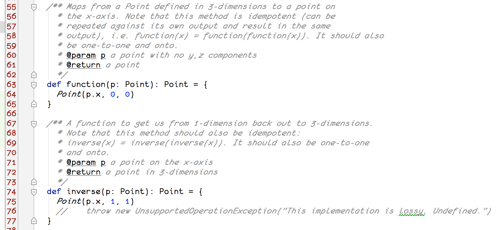
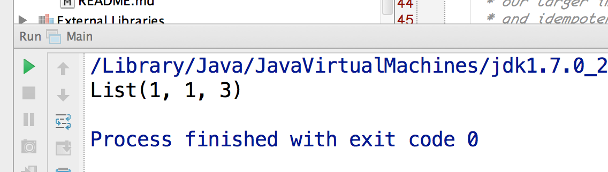

## Overview

There is a large category of computational problems that can be solved by storing a map of truth values.
Since a given value can be stored in a single bit, it is relatively cost-effective to pre-calculate values for large
combinations of [first-order logical](http://en.wikipedia.org/wiki/First-order_logic) constructs. Even problems
that do not appear to be formally logical in nature can be solved by trading precision in continuous variables
for an acceptably priced system in the end.

> The purpose of this post is to describe an algorithm for solving certain problems by storing large boolean
> indices in economically-feasible in memory data grids.

This will be accomplished in three examples:

1. Middle-school geometry
2. Tracking changes in a database (all of them)
3. An API &amp; recipe

We will finish with an analysis showing that storage can be substantially cheaper in the average case.

Our solution is a [scala](http://scala-lang.org) mash-up of <a href="http://en.wikipedia.org/wiki/Projection_(mathematics)">mathematical projection</a> with
the [distributed bitmap](http://docs.gigaspaces.com/sbp/distributed-bitmap.html) algorithm.

## Part 1: Storing 3-D coordinates

We start with a sound implementation of a mapping from a sequence of Points in 3-Dimensions to a sequence of Points on
the x-axis. Key code is shown here:

[source code is here](https://github.com/jasonnerothin/projectit/blob/2234fd3fd0764573e6662144a5b908815e6badd0/src/main/scala/com/jasonnerothin/project/Projection.scala)

What we have produced is a projection of all Points in 3-D to Points on the x-axis.

Now, let\'s assume that we start with the triangle given by the coordinates {(1,2,3), (1,3,4), (3,4,5)} as input:

[source code](https://github.com/jasonnerothin/projectit/blob/2234fd3fd0764573e6662144a5b908815e6badd0/src/main/scala/com/jasonnerothin/project/Projection.scala)

The triangle is in fact projected onto the x-axis, as desired. But there is a problem. Two, actually. To demonstrate
what we need to do to get a correctly-designed projection, we've demonstrated two things wrong with our current
implementation. The first is that our projection implementation is **not**
[one-to-one](http://www.regentsprep.org/Regents/math/algtrig/ATP5/OntoFunctions.htm):

[source code](https://github.com/jasonnerothin/projectit/blob/master/src/main/scala/com/jasonnerothin/project/Main.scala)

(1,0,0) is mapped to by (1, 2, 3) *and* (1, 3, 4). Therefore, we don't know how to pick the Point in 3-D that
corresponds to our Point in 1-D. Therefore, the projection is not *invertible*. Which means we cannot get our data
back out of a grid once written there.

So, let\'s update our projection so that it is both one-to-one and
[onto](http://www.regentsprep.org/Regents/math/algtrig/ATP5/OntoFunctions.htm):

