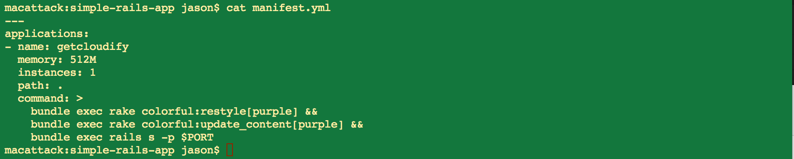
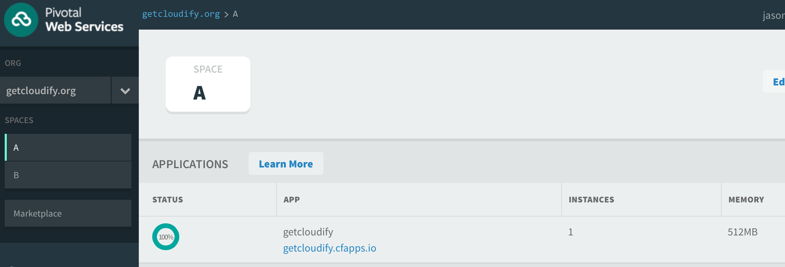

<link rel='stylesheet' href='../css/markdown7.css'/>
## Application Orchestration for Cloud Foundry : Part 1 

[Cloud Foundry](http://www.cloudfoundry.org) is a PaaS stack that provides easy-to-use management tools across popular application frameworks such as Node.js, PHP, Ruby on Rails and others. A number of Cloud Foundry providers now offer public cloud solutions. In this series, we will will use [Pivotal Web Services](http://run.pivotal.io) as our example provider. 

> This multi-part series describes how to implement application orchestration for Cloud Foundry. 
  
In this series of posts, we will demonstrate full application orchestration for Cloud Foundry, including deployment automation, scaling, monitoring and auto-recovery.

It should be noted that these techniques would work equally well with an in-house Cloud Foundry environment.

We'll break the work down into smaller sections:

1. [Application Orchestration For Cloud Foundry](#l1)
1. [Describing with a TOSCA blueprint](2015-05-07-tosca-for-cloud-foundries.html)
1. [Scaling with a local workflow](2015-05-07-workflow-for-cloud-foundries.html)
1. [Managing with a Cloudify plugin]
1. [Collecting logs and metrics]

## Cloud Foundry Topology 

Cloud foundry defines a strict hierarchy for organizing resources. At the top level is an [Org](http://docs.cloudfoundry.org/concepts/roles.html#orgs), which is the highest level of containment. Conceptually, it means &ldquo;organization&rdquo;. 

The next level down is the [Space](http://docs.cloudfoundry.org/concepts/roles.html#spaces). A Space can organize around an IaaS datacenter, a region, or any other organizational principle - say, for example, a QA tier. Spaces belong to exactly one Org.
 

**Figure 1: App Instances Spread Across An Org**

Finally, we have Apps, which deploy to a Space. As such, they can belong to one or more Space and even belong to a given Space more than once.

## Moving an App between Spaces

The simplest use case will be to deploy an app to one Space and then scale it to two App instances running in two Spaces belonging to the same Org.  

 
**Figure 2: Scaling App Instances**

### The application

We start by modifying a Ruby on Rails application [that is set up for Cloud Foundry](https://github.com/cloudfoundry-samples/rails_sample_app/blob/master/README.markdown). For simplicity, we [use railtie](http://stackoverflow.com/questions/19078044/disable-activerecord-for-rails-4) for ActiveRecord. Then we provide a [rake task](https://github.com/GigaSpaces-POCs/cfy-pivotal/blob/f7c7f093088b4ab9e9c7b4e40d8163bd4af167db/cf-apps/simple-rails-app/lib/tasks/colorful.rake) that takes a css color and styles our web pages. (More on this later.) The deployment-ready app is stored [here as part of the blog1 tag](https://github.com/GigaSpaces-POCs/cfy-pivotal/tree/blog1/cf-apps/simple-rails-app).

### Deployment

After signing up for [Pivotal](https://console.run.pivotal.io/register), we install the excellent [Cloud Foundry CLI tool](http://docs.run.pivotal.io/devguide/installcf/).

The simplest way to deploy an app is to go to the root of the application directory and call `cf push [some application name]`. By providing a file named manifest.yml, we can specify even more behavior, including calls to post-push commands. To illustrate this behavior, we call our custom rake task (and color our app's front page purple):

`cf push` output looks like this:

&hellip;some build output&hellip;

As we'd expect, the deployment shows up:

### Result

[Next >](2015-05-07-tosca-for-cloud-foundries.html) 