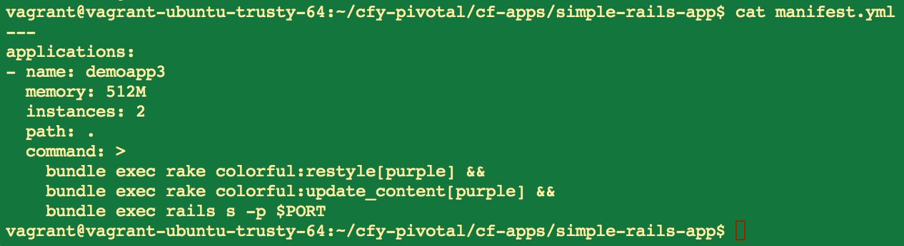
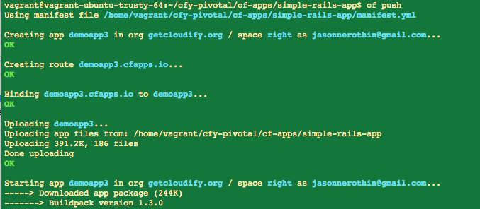
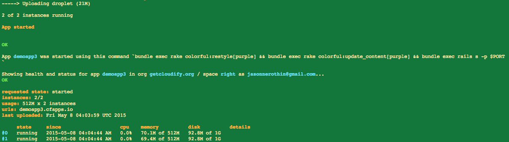
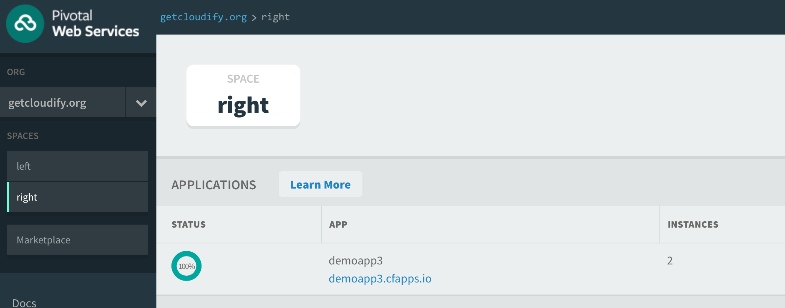
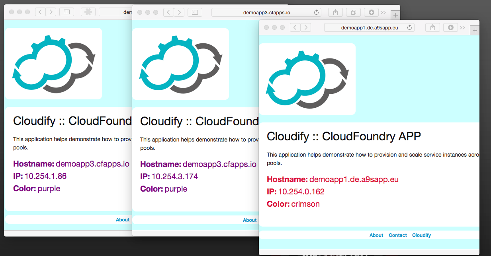

<link rel='stylesheet' href='../css/markdown7.css'/>
## Application Orchestration for Cloud Foundry : Part 1 

[Cloud Foundry](http://www.cloudfoundry.org) is a PaaS stack that provides easy-to-use management tools across a number 
of popular application frameworks like Node.js, PHP, Ruby on Rails and others. A number of Cloud Foundry providers now 
offer public cloud solutions. In this series, we will focus on [Pivotal Web Services](http://run.pivotal.io) and 
[Anynines](http://www.anynines.com).

> This multi-part series describes how to orchestrate an application across more than one Cloud Foundry PaaS provider.   

We'll break the work down into smaller sections:

1. [Deploying an application on two clouds](#l1)
1. [Describing with a TOSCA blueprint]
1. [Scaling with a local workflow]
1. [Managing with a Cloudify plugin]
1. [Collecting logs and metrics]

## Deploying an application across two clouds

### The application

We start by modifying a Ruby on Rails application [that is set up for Cloud Foundry](https://github.com/cloudfoundry-samples/rails_sample_app/blob/master/README.markdown). For simplicity, we [use railtie](http://stackoverflow.com/questions/19078044/disable-activerecord-for-rails-4) for ActiveRecord. Then we provide a [rake task](https://github.com/GigaSpaces-POCs/cfy-pivotal/blob/f7c7f093088b4ab9e9c7b4e40d8163bd4af167db/cf-apps/simple-rails-app/lib/tasks/colorful.rake) that takes a css color and styles our web pages. (More on this later.) The deployment-ready app is stored [here as part of the blog1 tag](https://github.com/GigaSpaces-POCs/cfy-pivotal/tree/blog1/cf-apps/simple-rails-app).

### Deployment

After signing up for [Pivotal](https://console.run.pivotal.io/register) and [Anynines](http://www.anynines.com), we install the excellent [Cloud Foundry CLI](http://docs.run.pivotal.io/devguide/installcf/). Both clouds run the same version of Cloud Foundry, so the CLI can be used with either after a call to `cf login [api endpoint]`. This enables some [convenient automation](https://github.com/GigaSpaces-POCs/cfy-pivotal/commit/1d6aa17f7bf562fa87be835c678cae79f70c02f2).

The simplest way to deploy an app (after `cf login`), is to go to the root of the application directory and call `cf push [application name]`. But by providing a file named manifest.yml, we can specify some useful options, including a call to our rake command (so that we can color this application purple):

Running the same `cf push` command goes like this:

Some build stuff&hellip;

As we'd expect, the deployment shows up:

### Result

As you can see, the app is deployed across multiple providers:

### Load-balancing

We will load-balance using HAProxy in step 4 of this series.
  
[Next >](2015-05-07-tosca-for-cloud-foundries.html) 