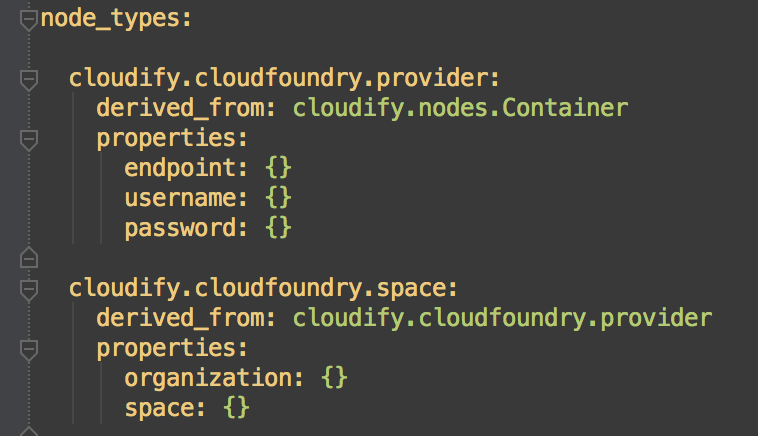
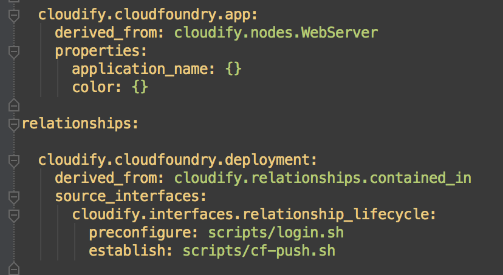
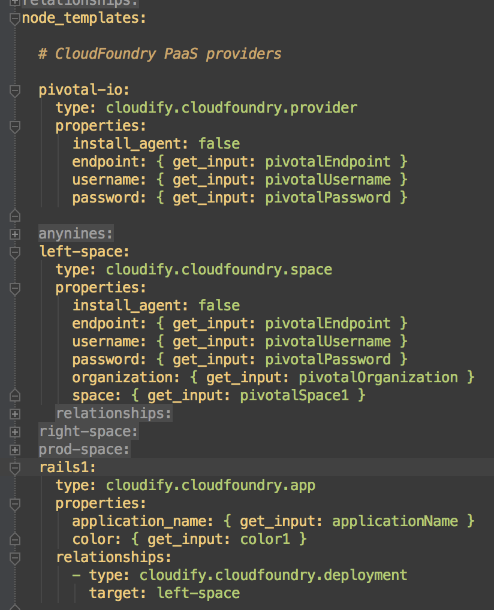
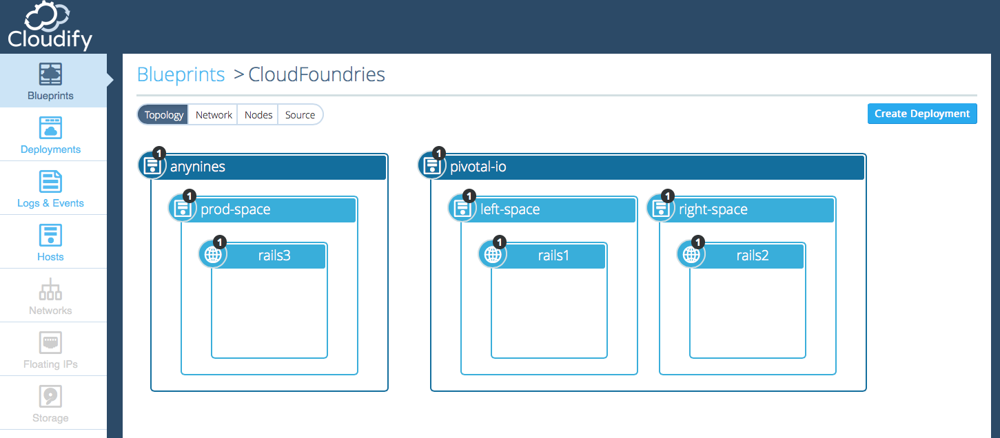

<link rel='stylesheet' href='../css/markdown7.css'/>
## Application Orchestration for Cloud Foundry : Part 2 

[TOSCA](https://www.oasis-open.org/committees/tc_home.php?wg_abbrev=tosca) is an open standard for describing and managing portable cloud applications. Version 1.0 of the specification defines a YAML syntax to describe **both** the topology and behavior of cloud applications.

> In this section, we will focus on describing the application topology. Later, we will show how to leverage this topology to add orchestration and management behavior to our application. 

1. [Deploying an application on two clouds](2015-05-07-multiple-cloud-foundries.html)
1. [Describing with a TOSCA blueprint](#l1)
1. [Scaling with a local workflow](2015-05-07-workflow-for-cloud-foundries.html)
1. Orchestrating with a Cloudify plugin
1. Collecting logs and metrics

## Describing with a TOSCA blueprint

At its core, a TOSCA blueprint is an orchestration plan. At the topology level, it allows us to describe a number of application components and their relationships. These concepts are modelled as [nodes](http://getcloudify.org/guide/3.2/reference-terminology.html#node) and [relationships](http://getcloudify.org/guide/3.2/reference-terminology.html#relationship). Both of these [types](http://getcloudify.org/guide/3.2/reference-terminology.html#type) contain all of the configuration and logic information necessary to describe the components (and later on to interact with them). 

The syntax is very flexible, and not bound to a particular cloud technology or terminology. Therefore, we need to create types that adequately describe our PaaS of choice: in this case it is Cloud Foundry.  

### Cloud Foundry Concepts

Cloud Foundry organizes application resources around two hierarchical concepts: [orgs](http://docs.cloudfoundry.org/concepts/roles.html#orgs) and [spaces](http://docs.cloudfoundry.org/concepts/roles.html#spaces). For simplification, orgs can be thought of as user accounts. Spaces are then user-defined categories (strictly belonging to an org) with which application resources can be managed. 

Since both providers have implemented the org concept as strictly commensurate with user account, there is no need to model org and space separately. Here is the TOSCA representation of a space:
  
 

Note that we do derive it from the provider type. (Since no space can exist without a Cloud Foundry provider!) 
 
We round out our types with a description of an app and a deployment (which is a **relationship** between an app and a space):
 

Notice that we have still only described components in the abstract: None of them relate to any physical things yet. 

To realize them in the context of a specific provider (Pivotal, let's say), we need to bind them to actual configuration data. We do so in the `node_templates` section:

This diagram lays out a pretty complete description of the first deployment of the rails application. It is:

1. Hosted by pivotal
1. Bound to some security credentials
1. Installed on a space called 'left'
1. Colored with `color1`
1. Named `applicationName`
1. Linked to specific startup and teardown behavior (not shown here)

### Uploading the Blueprint

The complete blueprint as part of the blog2 tag [here](https://github.com/GigaSpaces-POCs/cfy-pivotal/blob/blog2/plugin.yaml). When deployed to a Cloudify Manager (along with some input data), our application topology is displayed:

Next, we will use TOSCA to map a local workflow which will enable us to scale the application up and down across PaaS providers.

[< Last](2015-05-07-multiple-cloud-foundries.html) | [Next >](2015-05-07-workflow-for-cloud-foundries.html)