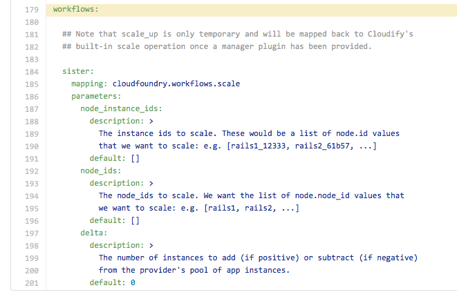

<link rel='stylesheet' href='../css/markdown7.css'/>
## Application Orchestration for Cloud Foundry : Part 3

> Here we show how to map and implement a custom workflow for scaling the application up and down.

To this point, we have only interacted with the running systems using the Cloud Foundry command line tool. But now that we have additional information in the form of a topology, it's useful to ask what additional options are opened up to us. To answer this question, we implement a local [workflow](http://getcloudify.org/guide/3.2/reference-terminology.html#workflow) to scale up and down.    

1. [Application Orchestration For Cloud Foundry](2015-05-07-application-orchestration-for-cloud-foundry.html)
1. [Describing with a TOSCA blueprint](2015-05-07-tosca-for-cloud-foundries.html)
1. [Scaling with a local workflow](2015-05-07-workflow-for-cloud-foundries.html)
1. Orchestrating with a Cloudify plugin
1. Collecting logs and metrics

## Scaling with a local workflow

Cloudify provides an API for [authoring custom workflows](http://getcloudify.org/guide/3.2/guide-authoring-workflows.html). 
  
In the following blueprint, we map a workflow named 'sister' to a chunk of Python code that is provided a workflow context:
 
 
 
In the corresponding code, we see that we can use the workflow context object to [enter "graph mode"](https://github.com/GigaSpaces-POCs/cfy-pivotal/blob/blog3/cloudfoundry/workflows.py#L125). This, in turn, enables us to walk the runtime system graph (topology) to calculate system information in a flexible manner.
   
Given the level of useful abstraction, whole new algorithms become easy to write: 
 
1. Add a new instance to each space.
1. Shift 25% of system capacity to the European datacenter when the sun rises in Prague.
1. and so on&hellip;
 
## A note on Policies
 
Custom workflows were designed with orchestration policies in mind. Since Cloudify 3.0, [an API has existed](http://getcloudify.org/guide/3.2/guide-authoring-policies.html) to allow defined events to be detected and reacted by invoking custom workflows.   

[< Last](2015-05-07-tosca-for-cloud-foundries.html) | [Next >](#)